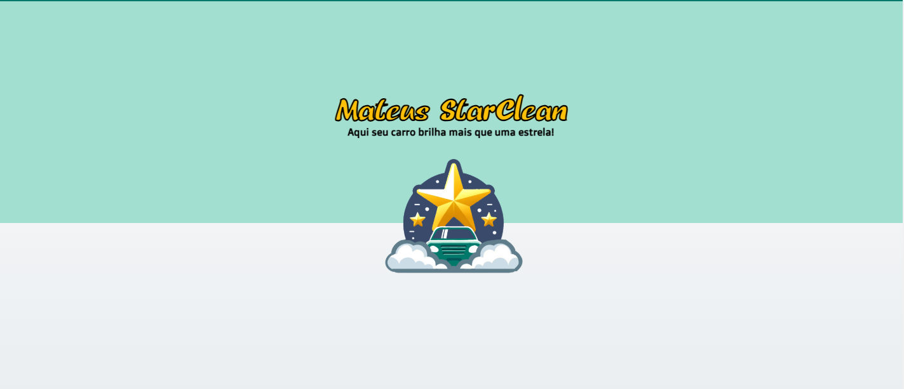
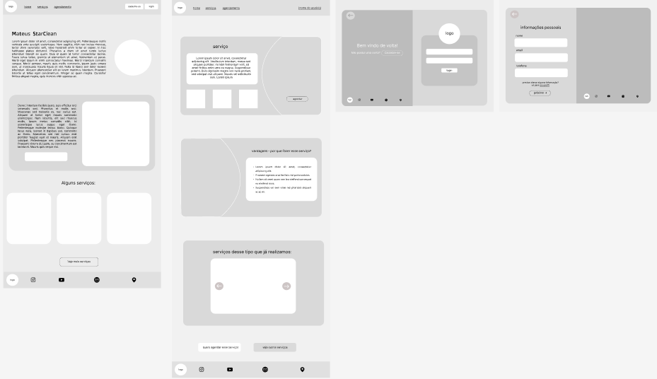
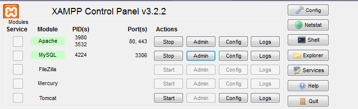
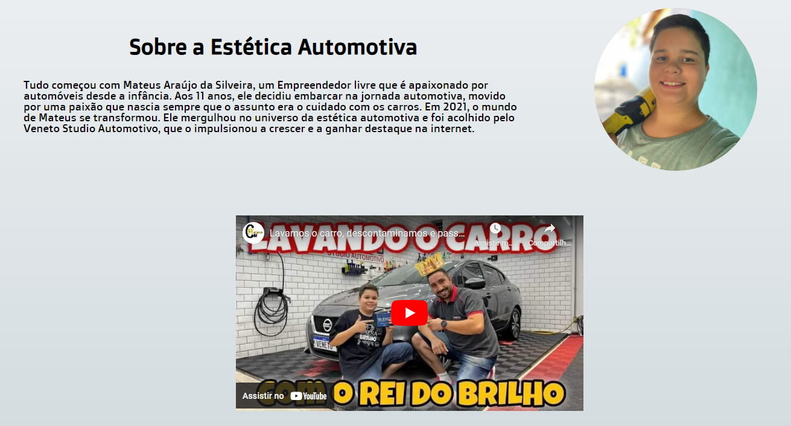
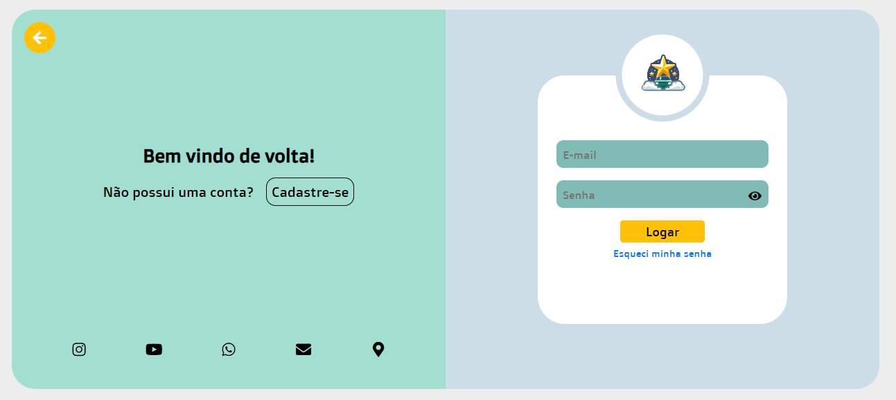
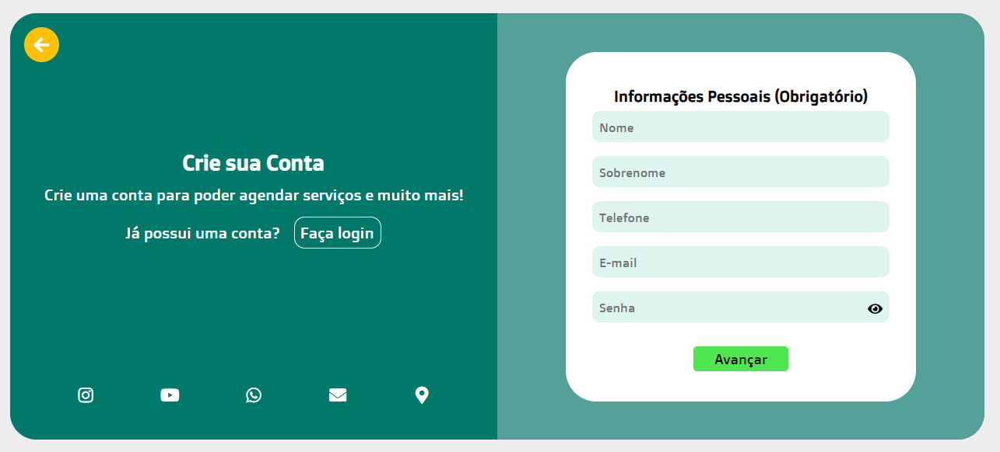
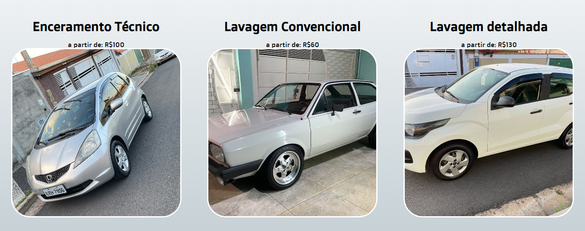
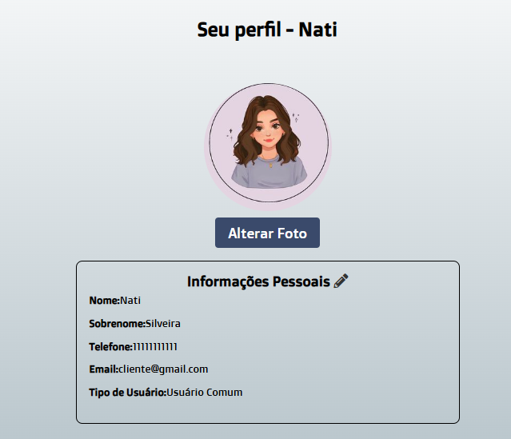
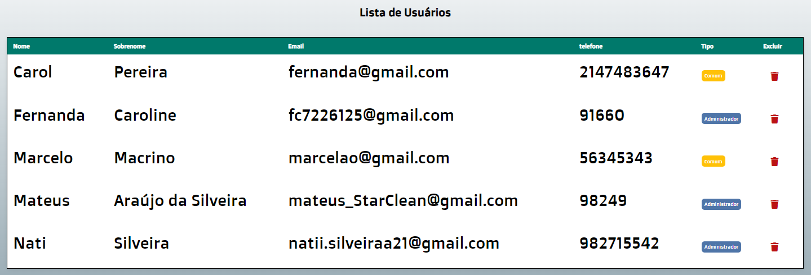
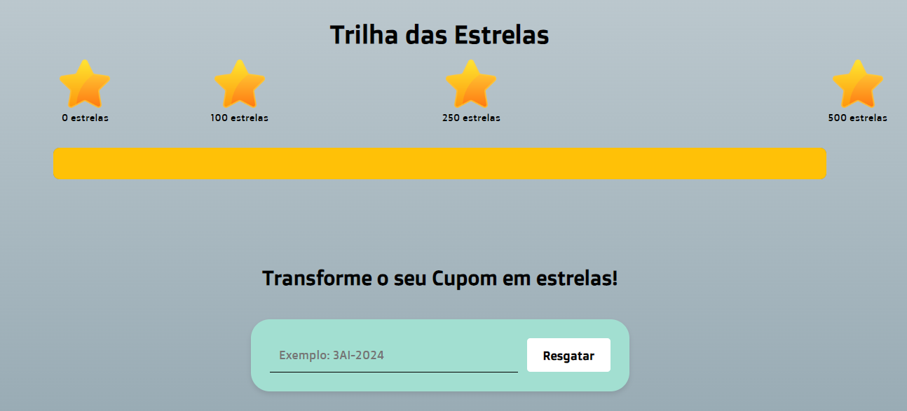

# Mateus StarClean

  

## 💻 Sobre o projeto

<h3>Trabalho de conclusão de curso - Mateus StarClean</h3>

<h3>Descrição</h3>

Este projeto foi desenvolvido como parte do Trabalho de Conclusão de Curso (TCC) para o ensino médio integrado ao técnico em informática para internet na ETEC de Campo Limpo Paulista. Ele aborda a importância da identidade visual, com o objetivo de propor melhorias no marketing para um empreendimento de estética automotiva.
 

<H4>Este trabalho foi feito por:</H4>

Fernanda Caroline Santos Pereira

Natália Araújo da Silveira

<h4>Com as Orientadoras:</h4>

Thaynara Cristina Maia dos Santos e Barbara Kathellen Andrade Porfirio

<h3>Por que este projeto foi feito?</h3>

A motivação para o desenvolvimento deste projeto surgiu da necessidade de aprimorar o marketing do empreendimento de estética automotiva de Mateus Araújo da Silveira, um empreendedor autônomo livre. Seu negócio enfrentava dificuldades devido à ausência de uma identidade visual coesa e alinhada com os valores da empresa, o que comprometia sua capacidade de atrair e fidelizar clientes. A falta de uma identidade visual impactante resultava em uma percepção de marca pouco definida e pouco atrativa, prejudicando a estratégia de marketing e dificultando o posicionamento no mercado competitivo. Nesse contexto, este trabalho propôs a renovação completa da identidade visual, com o objetivo de fortalecer a imagem do empreendimento e destacar sua personalidade no setor automotivo. 

<h3>Com este trabalho, buscamos: </h3>

•	Criar uma nova identidade visual e desenvolver um manual da marca: Proporcionando uma representação coesa e atrativa que reflita os valores e objetivos do empreendimento.

	

•	Definir o público-alvo: Identificando e compreendendo as características do público a ser atendido, para direcionar de forma eficaz as estratégias de comunicação e marketing.

	

•	Desenvolver um sistema web: Integrar a nova identidade visual ao ambiente digital, automatizando o processo de agendamento de serviços, facilitando o atendimento ao cliente e fortalecendo a conexão entre a marca e seus consumidores.

---

## 🎨 Layout

O layout da aplicação está disponível no Figma. Acesse abaixo o protótipo de **Média Fidelidade**:

  

---

## 🛠️ Como executar o projeto

### Este projeto é dividido em cinco partes:

1. **Backend** (`pasta server`)
2. **Frontend HTML** (`pasta web`)
3. **CSS** (`pasta estilização`)
4. **Arquivos de Fonte** (`pasta src`)
5. **Vendor** (para utilização do Composer)

💡 **Recomendação:** Para uma melhor experiência, use o **Composer** para gerenciar dependências.

---

### 📥 **Pré-requisitos**

Antes de começar, você precisa instalar as seguintes ferramentas:

- [XAMPP](https://sourceforge.net/projects/xampp/files/XAMPP%20Windows/8.0.30/xampp-windows-x64-8.0.30-0-VS16-installer.exe/download)
- [Composer](https://getcomposer.org/download/)

Coloque todos os arquivos do projeto em uma única pasta para facilitar a execução.

---

### ⚙️ **Rodando o Backend (Servidor)**

1. Abra o **XAMPP** e inicie os serviços do **Apache** e **MySQL**.

  

2. Acesse o **phpMyAdmin** através do botão "Admin" do MySQL e crie um novo banco de dados chamado `Mateus_StarCleanTCC`.

3. Importe o arquivo SQL que está na pasta `backend/database` para o banco de dados criado.

  

Agora, o banco de dados está configurado e pronto para rodar.

---

### 🌐 **Rodando a aplicação web (Frontend)**

1. **Baixe e organize** as pastas conforme mencionado acima.
2. Abra o navegador e acesse o arquivo HTML da aplicação.

Logo na primeira página, você verá a **história da marca**, para conhecer melhor o empreendimento.

  

3. Você também pode **fazer login ou cadastro**:

  

  

4. Agende os serviços que estarão disponíveis na plataforma:

  

5. Acesse seu **perfil** para visualizar seus dados e serviços agendados:

  

---

### 🔑 **Credenciais de Acesso**

Para acessar a página de administração, utilize as seguintes credenciais:

- **Administrador**:
  - Email: `fc7226125@gmail.com`
  - Senha: `espanha`

- **Cliente**:
  - Email: `fernanda@gmail.com`
  - Senha: `espanha`

O **administrador** pode gerenciar serviços, usuários, cupons e prêmios, além de visualizar os agendamentos dos clientes.

  

O **cliente** pode agendar serviços, visualizar serviços agendados e participar do programa de fidelidade.

  

---

## 📜 Citação

> PEREIRA, Fernanda; SILVEIRA, Natalia; LIMA, Willian. **Identidade visual e marketing: justificativas e proposta para o redesign de uma estética automotiva**. 2024. 40 p. Artigo.

---

## 👩‍💻 Autoras

- **Fernanda Pereira** [Instagram](https://www.instagram.com/FernandaPereira529)
- **Natália Silveira** ✨

---

## 📝 Licença

Feito com ❤️ por **Fernanda Pereira** e **Natália Silveira**.  
Entre em contato: [Instagram](https://www.instagram.com/FernandaPereira529)

---
