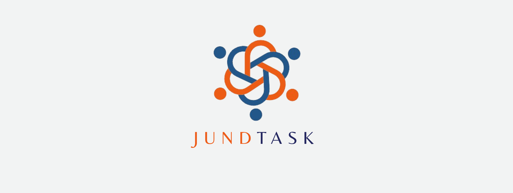
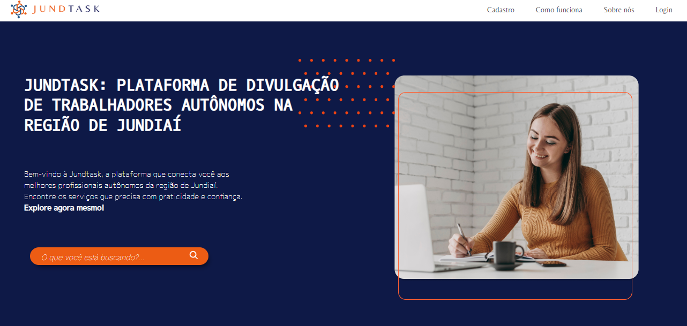

[JAVASCRIPT__BADGE]: https://img.shields.io/badge/Javascript-000?style=for-the-badge&logo=javascript

<h1 align="center" style="font-weight: bold;">Implementação de uma plataforma digital na divulgação de trabalhadores autonômos na região de Jundiaí</h1>


![javascript][JAVASCRIPT__BADGE]

<p align="center">
 <a href="#about">Sobre</a> • 
 <a href="#started">Preparação para a inicialização do projeto</a> • 
 <a href="#initializing">Inicializando o projeto</a> • 
 <a href="#colab">Autores</a> •
 <a href="#contribute">Como citar o projeto</a> 
</p>

<p align="center">
    
</p>
<h2 id="about">📌 Sobre</h2>

 A plataforma desenvolvida tem como objetivo facilitar a conexão entre trabalhadores autônomos e clientes na área de Jundiaí, promovendo os serviços desses profissionais de maneira prática e acessível. A interface é projetada para ser intuitiva, permitindo que tanto trabalhadores quanto clientes naveguem facilmente e encontrem o que precisam, auxiliando numa experiência simplificada para ambos os tipos de usuário.


<h2 id="started">🚀 Preparação para a inicialização do projeto</h2>
A inicialização do JundTask é simples, mas é importante garantir que você atenda aos requisitos mínimos para evitar erros. Certifique-se de que está utilizando uma versão igual ou superior às indicadas abaixo.

<h3>Pré requisitos</h3>

<table>
 <tr>
  <td>HTML</td>
  <td>CSS</td>
  <td>Bootstrap</td>
  <td>JavaScript</td>
  <td>PHP</td>
  <td>Xamp</td>
 </tr>
 <tr>
  <td>HTML5</td>
  <td>CSS3</td>
  <td>5.3</td>
  <td>1.8</td>
  <td>8.1.25</td>
  <td>8.1.25</td>
</tr>
</table>

<h3>Clonando o projeto</h3>

A clonagem do projeto pode ser feita apenas digitando a linha de código abaixou ou baixando o projeto.

```
git clone https://github.com/Gineris/siteatualizado.git
```

<h2 id="initializing">Inicializando o projeto</h2>

<ol>
  <li>
    <strong>Inicie o XAMPP</strong> e ative o servidor Apache e o banco de dados MySQL.
  </li>
  <li>
    <strong>Importe o banco de dados:</strong>
    <ul>
      <li>O arquivo do banco de dados está disponível no repositório.</li>
      <li>Use o phpMyAdmin para importar o arquivo.</li>
    </ul>
  </li>
  <li>
    <strong>Mova o repositório para a pasta <code>htdocs</code>:</strong>
    <ul>
      <li>Coloque a pasta clonada em <code>C:\xampp\htdocs</code>.</li>
    </ul>
  </li>
  <li>
    <strong>Abra o navegador e acesse o projeto:</strong>
    <ul>
      <li>Digite <code>http://localhost/siteatualizado</code> no navegador.</li>
    </ul>
  </li>
</ol>

<p>Você verá a seguinte tela inicial:</p>

<p align="center">
  
</p>

<h3>Criando uma conta</h3>
<p>
  Para usar todas as funcionalidades do site, você precisa estar logado. Caso ainda não tenha uma conta:
</p>
<ol>
  <li>Clique no botão <strong>Login</strong>.</li>
  <li>Escolha a opção <strong>Criar Conta</strong>.</li>
  <li>Preencha os dados, é fácil e rápido!</li>
</ol>
<p>
  Após o login, você terá acesso total às funcionalidades do site.
</p>
<p>
  Caso queira acessar a aréa do administrador use: <br>Login - Admin@gmail.com <br> Senha - 123 <br> ele funcionará tanto no "login cliente" como no "login trabalhador"
</p>

<h2 id="colab">🤝 Autores</h2>

Estes são os autores, que fizeram a parte escrita e prática do projeto

<table>
  <tr>
    <td align="center">
        <br>
        <sub>
          <b>Guilherme Campos</b>
        </sub>
    </td>
    <td align="center">
        <br>
        <sub>
          <b>Mateus Costa</b>
        </sub>
    </td>
    <td align="center">   
        <br>
        <sub>
          <b>Giovana Gouveia</b>
        </sub>
    </td>
  </tr>
</table>
<h2 id="contribute">📫 Como citar o projeto</h2>

Se você utilizar este projeto em sua pesquisa, artigo, ou trabalho, por favor, cite-o da seguinte forma:

CAMPOS, Guilherme; COSTA, Mateus; GOUVEIA, Giovana. <strong>Implementação de uma plataforma digital na divulgação de trabalhadores autonômos na região de Jundiaí</strong>. GitHub, ano. Disponível em: <https://github.com/Gineris/siteatualizado>. Acesso em: dia mês ano.


