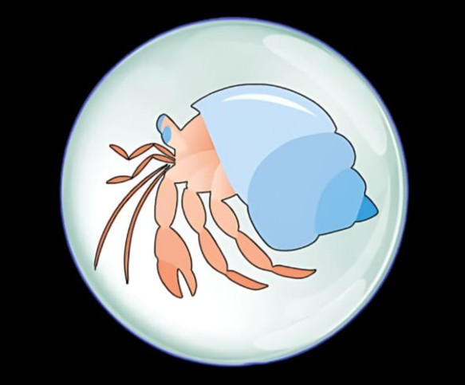
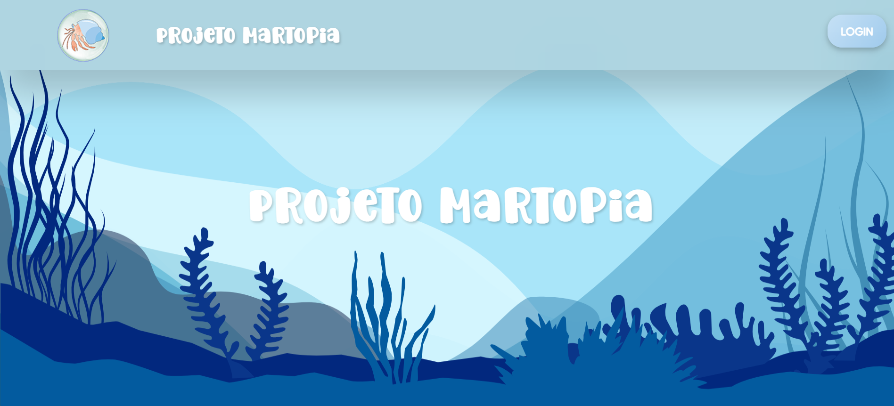
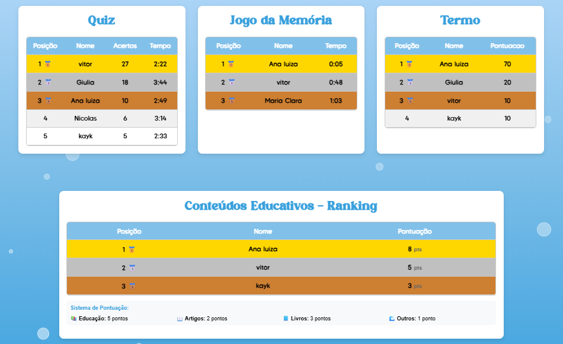
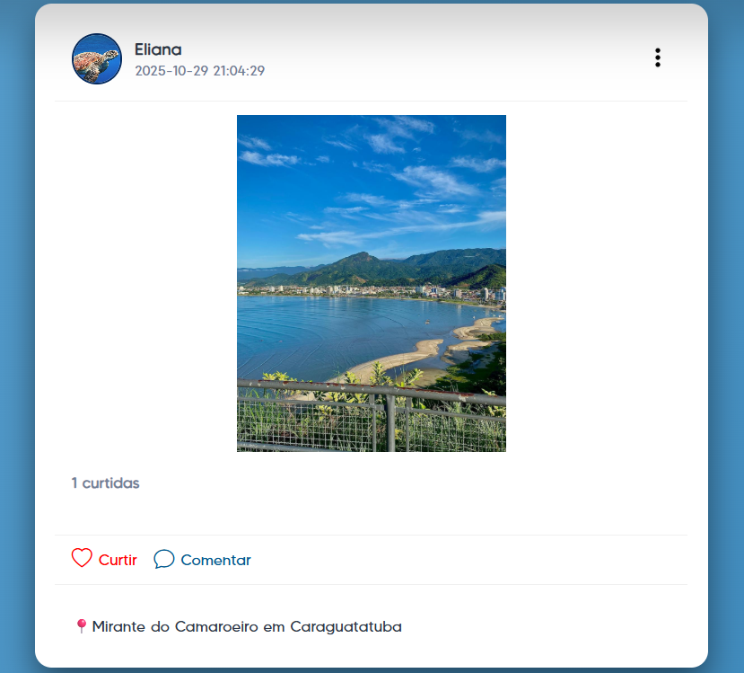
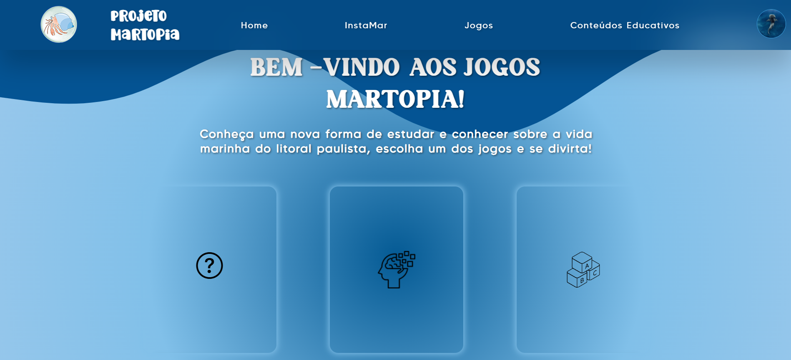

# PROJETO MARTOPIA: Desenvolvimento de um sistema web para auxiliar na educação de jovens do interior de São Paulo sobre a vida marinha do litoral paulista.
 

## Descrição 

O Projeto Martopia surgiu a partir da identificação de uma importante problemática entre jovens do interior do estado de São Paulo: o pouco contato com o ambiente marinho resulta em baixo conhecimento sobre a biodiversidade do litoral paulista e, consequentemente, em menor conscientização sobre a preservação das espécies. Pesquisas mostraram que esses jovens visitam o litoral poucas vezes ao ano e que a escola raramente aborda de forma aprofundada a vida marinha, evidenciando uma lacuna educacional significativa.
Com o objetivo de reduzir esse problema, o Projeto Martopia foi desenvolvido como uma plataforma educativa e interativa, com design adequado à faixa etária do público-alvo. O sistema aproxima os usuários da realidade marinha por meio de recursos como jogos, um aquário virtual, conteúdos educativos diversos e um ranking de desempenho, incentivando a aprendizagem de forma divertida. Além disso, a plataforma conta com o InstaMar, um espaço de interação social onde os usuários podem compartilhar experiências, trocar conhecimentos e interagir entre si.

## Equipe 

Giulia da Cruz Favaro - Front-end

Edson Adrian Paxi Soto - Back-end 

Clara Mortarelo da Cunha - Design  

Orientadores: Thaynara Andrade e Barbara Porfirio

## Tecnologias Utilizadas 

- HTML versão 5
- CSS versão 3
- JavaScript versão ES2025.
- PHP versão  8.5.0 
- MySQL versão 8.1.0

## Imagens do sistema 

## Como executar o projeto 

1 - Essa aplicação utiliza PHP na programação, por isso antes de tudo é necessário fazer a instalação do aplicativo Xampp, que pode ser feita no seguinte link: < https://www.apachefriends.org/pt_br/index.html >. Instale a versão compatível com o seu sistema operacional (Windows ou Linux). 

2 - Baixe o arquivo do projeto na pasta SRC e descompacte-o no seguinte caminho de pastas (hd principal -> xampp-> htdocs). 

3 - Pesquise pelo aplicativo XAMPP e abra-o, em seguida clique em “Start” nos nomes Apache e MySQL, clique em “Admin” no MySQL (essa ação abrirá uma janela em seu navegador dó  PHPMyAdmin). 

4 - Já no PHPMyAdmin clique em “novo” na barra lateral e no campo de “Nome do banco de dados” coloque vidamarinha, tudo junto e minúsculo, depois clique em “criar”. 

5 - Vá na aba “Importar” no menu superior e escolha o arquivo vidamarinha.sql e clique em “Importar”. 

6 - Abra uma nova guia no seu navegador, de preferência use o Chrome, pois ele se adapta melhor às funcionalidades com JS. Nessa guia, na Barra superior de pesquisa, escreva: “localhost/src”. E clique na “Enter” no seu teclado.

7 - Clique em “front-end” para acessar o sistema. 

## Como citar o projeto

SOTO, Edson Adrian Paxi; FAVARO, Giulia da Cruz; DA CUNHA, Clara Mortarelo. Projeto Martopia: desenvolvimento de um sistema web para auxiliar na educação de jovens do interior de São Paulo sobre a vida marinha do litoral paulista. 2025. 

Em caso de dúvidas entre em contato com giulia.favaro7@gmail.com, claramortareloc@gmail.com ou adrianpaxisto@gmail.com 

Para acessar o trabalho escrito do projeto acesse: https://ric.cps.sp.gov.br/